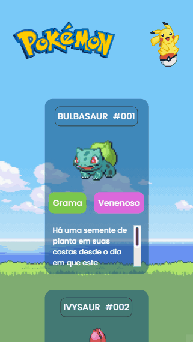

# Meu primeiro projeto
Um projeto feito do curso DevQuest, uma lista Pokemon com tema claro e tema escuro com cards em lista. 🧠🌠
## Esta é a versão em web desktop


## Esta é a versão de smartphone


## Tecnologias utilizadas
- HTML
- CSS
- JavaScript

## Acesse o projeto
```
https://areendmendes.github.io/Projeto-pokemon/
```
Explore o quanto quiser, estou iniciando aqui minha jornada!
Obrigado por visitar meu projeto.

### Participante: 
|name|email|present|receiveCertificate|course|
| -------- | -------- | -------- |-------- | -------- |
|Areend Mendes|areend.mendes@icloud.com|true|false|Bootcamp web developer|